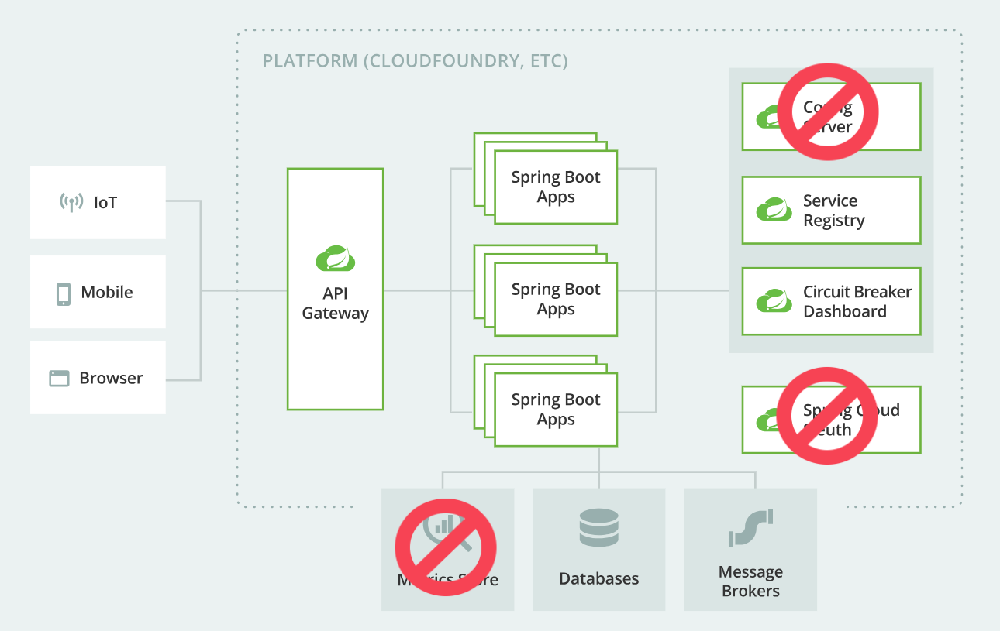

# Micro Services com Java Spring

Micro services com Java Spring é um projeto fictício para teste das soluções Spring Cloud.
Neste projeto foram implementadas a APIs de micro serviço, Migrations (para tratar de criação
e versionamento dos scripts de banco de dados MySQL), Service Discovery, Balanceamento de Carga,
API Gateway para centralização de requisições, Circuit Breaker, Fallback (resiliência a falhas) e
Message Brker (RabbitMQ).

### 🛠 Tecnologias
1. JDK 17
2. Maven 3
3. Spring Boot 3.2.2
4. MySQL
5. Eureka by Netflix
6. Flyway
7. Lombok
8. Model Mapper
9. OpenFeign
10. Resilience4J
11. Spring AOP
12. RabbitMQ (Message Brokers) v3.12
13. Spring AMQP

### ⚙️ Funcionalidades

- [x] Cadastro de pagamentos
- [x] Cadastro de pedidos
- [x] Integração síncrona de pagamentos com pedidos
- [x] Integração assíncrona de pagamentos com pedidos e avaliação

### Instruções para uso da arquitetura



Os projetos estão organizados em submodulos para melhor entendimento. Faça o clone de todos
os projetos utilizando o comando:

```git clone --recursive https://github.com/tradin-agro/micro-services-java-spring.git```

- Abra cada um dos projetos individualmente na sua IDE, e execute o arquivo main de cada projeto,
começando pelo projeto Eureka, depois Gateway, em seguida as aplicações.
- Para testar o balanceamento use endpoint de porta http://localhost:8082/pedidos-ms/pedidos/porta
- Antes do teste de balanceamento deverá subir uma nova instância da aplicação, informando 
o caminho do java da sua máquina mais o comando para execução do jar instalado na pasta target do projeto Pedidos.
Por exemplo: ```C:\Oracle\java\jdk-17\bin\java -jar pedidos-0.0.1-SNAPSHOT.jar br.com.tradin.pedidos.PedidosApplication```
no prompt do Windows (se for o seu caso), o comando funcionará na pasta /target. Conforme vai
subindo instâncias, as portas vão sendo alternadas a cada requisição.
- Para testar o Circuit Breaker e Fallback, deverá inserir um novo pagamento e um novo pedido. O 
pagamento inserido deve estar vinculado ao id do pedido. Derrube todas as instâncias do projeto
Pedidos e aguarde algum tempo. Depois execute o endpoint http://localhost:8082/pagamentos-ms/pagamentos/2/confirmar
informando na URL o id do seu pagamento. O pagamento será salvo com o status CONFIRMADO_SEM_INTEGRACAO, e o 
registro do pedido não terá seu status atualizado. Poderá testar também com projeto Pedidos funcionando, onde
o status do pedido será atualizado, executando normalmente a integração.
- No endereço http://localhost:8081 vai acessar a página do Eureka server, onde poderá ver as
instâncias de aplicação que estão rodando naquele momento. 
- A instância do projeto Gateway está configurada para rodar no endereço http://localhost:8082 e as requisições
para os aplicativos registrados devem usar o nome de registro de cada aplicação, por exemplo: 
http://localhost:8082/pedidos-ms/pedidos e http://localhost:8082/pagamentos-ms/pagamentos
- Seu arquivo de properties de cada projeto deve ser configurado com o seu usuário e senha do 
banco de dados MySQL, as aplicações usam banco de dados individuais.
- Aqui estão disponíveis os testes da API via POST MAN. Faça o download dos arquivos para importação.
  https://github.com/tradin-agro/micro-services-java-spring/blob/main/tradin-pagamentos.postman_collection
e https://github.com/tradin-agro/micro-services-java-spring/blob/main/tradin-pedidos.postman_collection
- Para adicionar um submodulo ``` git submodule add https://github.com/tradin-agro/avaliacao.git avaliacao/ ```, em seguida
```git add .```, depois ```git commit -m "comentario"``` e ```git push```
- ```git submodule update --remote --merge``` para atualizar submodulos, em seguida ```git add .```, 
depois ```git commit -m "comentario"``` e ```git push```

### Observações importantes
- O projeto Avaliação não fará conexão com Eureka ou com o Gateway API. É um projeto que estará rodando
a parte, e disponível na porta 8080. Spring Boot v2.7.3, diferente da versão dos outros projetos.
- O projeto RabbitMQ é um docker-compose que deverá ser inicializado via Docker, onde foram mantidas as
configurações de acesso padrão, após executado e rodando estará disponível na porta 15672 para a conexão
das outras aplicações.
- Caso seja necessário criar novas instâncias em cluster do RabbitMQ deverá executar os comandos, agrupando
as instâncias em um rede única:

comando para criar rede:

```docker network create --driver bridge tradin-rede```

comando para criar novos containers do rabbitmq, substitua "rabbit-nome1" e o número da porta desejada em 8085:

```docker run -d --rm --net tradin-rede --hostname rabbit-nome1 --name rabbit-nome1 -p 8085:15672 -e RABBITMQ_ERLANG_COOKIE=tradin_secret rabbitmq:3.12-management```

comando para parar container que deseja fazer cluster com outro, substitua "rabbit-nome1":

```docker exec -it rabbit-nome1 rabbitmqctl stop_app```

comando para resetar container, substitua "rabbit-nome1":

```docker exec -it rabbit-nome1 rabbitmqctl reset```

comando para juntar em cluster, substitua "rabbit-nome1" e "rabbit@rabbit":

```docker exec -it rabbit-nome1 rabbitmqctl join_cluster rabbit@rabbit```

comando para iniciar container, substitua "rabbit-nome1":
```docker exec -it rabbit-nome1 rabbitmqctl start_app```

- Pelo docker-compose estão ativos na configuração de plugins do RabbitMQ ```rabbitmq_management,rabbitmq_prometheus, rabbitmq_shovel, rabbitmq_shovel_management```


## 📝 Licença

Este repositório é livre, estude bastante e seja feliz!<br/>
Em caso de dúvidas, entre em contato.<br/>
Giovanni Biffi<br/>
Tradin Ltda<br/>